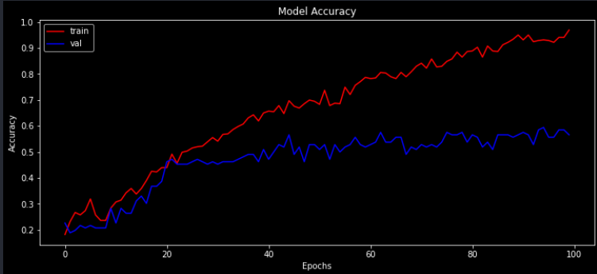
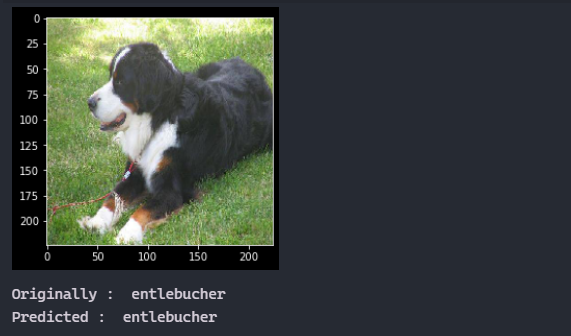

# Dog breed prediction

- In this project, I have used tensorflow and keras to build train and test a convolutional nueral network to predict dog breed.

## Steps to build project

1. Load the dataset from Kaggle. ***IMPORTANT*** [Download Data set from Here](https://www.kaggle.com/catherinehorng/dogbreedidfromcomp/download) **SIZE: 750MB**
2. Load labels from CSV for lables that contain an image ID and breed.
3. Checking the breed count.
4. ONT-HOT Encoding on lables data PREDIC.TION column.
5. Load the images, Convert them to an array & nirmalize them.
6. Check the shape and size of the X and Y Data.
7. Building the model Network Architecture.
8. Split the data and fir it into the model and create new accuracy point.
9. Evaluate the model for accuracy score.
10. Using the model for prediction.

## NOTE: If you have Ananconda installed then you will not need requirements.txt because anaconda comes will preinstalled pachages

## NOTE: This project will take about 1 hour to run Depends on your computer

### Accuracy Graph

### Output

